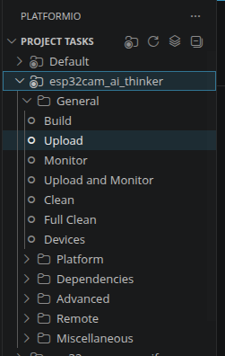
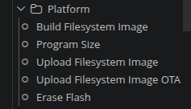

# exp32CamFirmware

>[!IMPORTANT]
> This is a fork of the project by @rzeldent: [ESP32CAM-RTSP](https://github.com/rzeldent/esp32cam-rtsp).
> This incorporates additional functionalities needed for the proper integration with the `Curious Beagle` platform. 


>[!NOTE]
> A tool for flashing cameras tailored to the `Curious Beagle` platform is also provided on: [rexCameras](https://github.com/DopamineLabsLTDA/rexCameras).


**This firmware allows to deploy a RTSP stream and configuration web-interface onto the ESP32 based cameras.**


## Summary 

The firmware implements a simple web-server onto each of the cameras. By connecting directly onto the camera's assigned IP, one can access to the camera's configuration panel and perform basic information changes, network changes and image and video changes. 

A RTSP stream is generated from the MJPEG stream of the camera. This allows for better video and connectivity with the backend. 

>[!WARNING]
>This type of MJPEG RTSP stream is not supported by typical streaming platforms, for example, cloudflare's stream platfors, as they are expecting a H.264 video stream.
>To relay the stream to this type of platforms, transcoding is required. 
> go2RTC project allows to properly deliver this MJPEG RTSP without transcoding to end-users. One of the reasons why it was selected as the `Curious Beagle` platform video module. 

The firmware also detects the presence of a network change. In the event the camera cannot connect to the network, for any reason (i.e password change), the camera will setup an access-point (AP) on which one can connect and directly stream or configure the device. 

**For reference on base-functionalities please refer to the original project repo: [ESP32CAM-RTSP](https://github.com/rzeldent/esp32cam-rtsp).**

## Additional functionalities

To properly work in the context of the `Curious Beagle` platform, some minor tweaks were implemented onto the firmware. This changes provide the following functionalities: 

- Ability to setup WiFi parameters, such as:    
    - static IP
    - gateway
    - netmask
- Configuration using .json file flashed onto memory.
- Ability to flash parameters directly onto device, without user configuration: Useful when flashing multiple cameras using the provided automatic tool. 
- Integration of the network parameters onto the internal web-configuration client. 

## Changes 

The aforementioned additional functionalities were implemented with the following changes: 

- Static IP, gateway and netmask on the configuration process: For the iotWebConf, an static handler was added before calling the initialization module. The resulting handler, located on the `main.cpp` 

```cpp
// On main.cpp
void staticIPHandle(const char* ssid, const char* password)
/*
.
.
some other lines
.
.*/

// module initialization
iotWebConf.setWifiConnectionHandler(staticIPHandle);
iotWebConf.init();
```

The `staticIPHandle` receives the SSID, the password and loads from the parameter buffers, the current values for the desired IP, gateway and netmask and passes them to `WiFi.config` method underneath. 


- Adding static settings onto UI, configuration using JSON and default values: the firmware uses a JSON structured file to store the current settings, displayed on the UI, onto memory for persistent configurations. As natively doesn't support the static IP, gateway and netmask, this needed to be added to be properly preserved during power cycles. This also allowed to load pre-set configurations during the flashing of the device, allowing for batch flashing using the tailored tool mentioned earlier. 

```cpp
// Adding the network configuration setting onto UI : main.cpp
#define STRING_LENGTH 128
char ipAddressValue[STRING_LENGTH];
char gatewayValue[STRING_LENGTH];
char maskValue[STRING_LENGTH];

auto param_config_group = IotWebConfParameterGroup("conn", "Connection parameters");
auto param_ip_address = IotWebConfTextParameter("IP Address", "ipAddress", ipAddressValue, STRING_LENGTH, REXBACK_IP, REXBACK_IP, "");
auto param_gateway = IotWebConfTextParameter("Gateway", "gateway", gatewayValue, STRING_LENGTH, REXBACK_GATE, REXBACK_GATE, "");
auto param_mask = IotWebConfTextParameter("Mask", "netmask", maskValue, STRING_LENGTH, REXBACK_MASK, REXBACK_MASK, "");
/*
.
.
some other lines
.
.
*/
param_config_group.addItem(&param_ip_address);
param_config_group.addItem(&param_gateway);
param_config_group.addItem(&param_mask);
iotWebConf.addParameterGroup(&param_config_group); // This adds the configuration group onto the iotWebConf interface.
```
To store the configuration onto memory, LittleFS was used to write the JSON file onto flash. 

>![WARNING]
> At the point of writing this, the latest version of the LittleFS from the [lorol repo](https://github.com/lorol/LITTLEFS) 1.0.6, nevertheless this version had problems reported when performing certain operations, so version 1.0.5 was used instead, is critical to respect the version used and not the latest one. 

```cpp
// JSON file integration : main.cpp
#include <LITTLEFS.h>
#define LittleFS LITTLEFS

// This functions read the values from the config.json flashed onto memory and loads it onto the iotWebConf. 
void readConfigFile()
/*
.
.
some other lines
.
.
*/
// After iotWebConf initialization, the values are loaded onto the buffers from memory
iotWebConf.init();
readConfigFile();
```

With this configurations, a default config file is device onto `data/config.json`: 

```json
{
    "iwcAll": {
        "iwcSys": {
            "iwcThingName": "rexCamera-ESP32",
            "iwcApPassword": "rexcamera",
            "iwcApTimeout": "30",
            "iwcWifi0": {
                "iwcWifiSsid": "SSID_STRING", // Notice this are placeholder values
                "iwcWifiPassword": "PASSWORD_STRING"
            }
        },
        "iwcCustom": {
            "conn": {
                "ipAddress": "A.B.C.D", // Notice this are placeholder values
                "gateway": "Q.W.R.T",
                "netmask": "F.G.H.J"
            },
            "camera": {
                "fd": "10",
                "fs": "HD (1280x720)",
                "q": "14"
            }
        }
    }
}
```
This file setups the default configuration after flashing, allowing the user to flash multiple cameras without having to configure each one of them manually. 

**More variables, from the available parameter could also be assigned default values, and defined in the config.json file.**

>[!NOTE]
>The configurations for the camera were iteratively tested for performance, yielding the values on the config.json file. Changing these default values could result in lower performance.  


## Manual flashing

The following instructions use the Platform IO VS Code extension to build the filesystem image, the firmware and flash it onto the device. 

### Requirements

Install the [Platform IO extension for VS Code](https://marketplace.visualstudio.com/items?itemName=platformio.platformio-ide). 

### Instructions

1.  From the platform IO Project Tasks, select the `esp32cam_ai_thinker` submenu. 



2. From the `platform` submenu: 
    - Select `Build Filesystem Image` to generate the image based of the `config.json` file.
    - Select `Upload Filesystem Image` to flash it onto the device. 



3. From the `General` submenu:
    - Select `Build` to compile the firmware.
    - Select `Upload and Monitor` to flash the device and monitor the status prints. 

